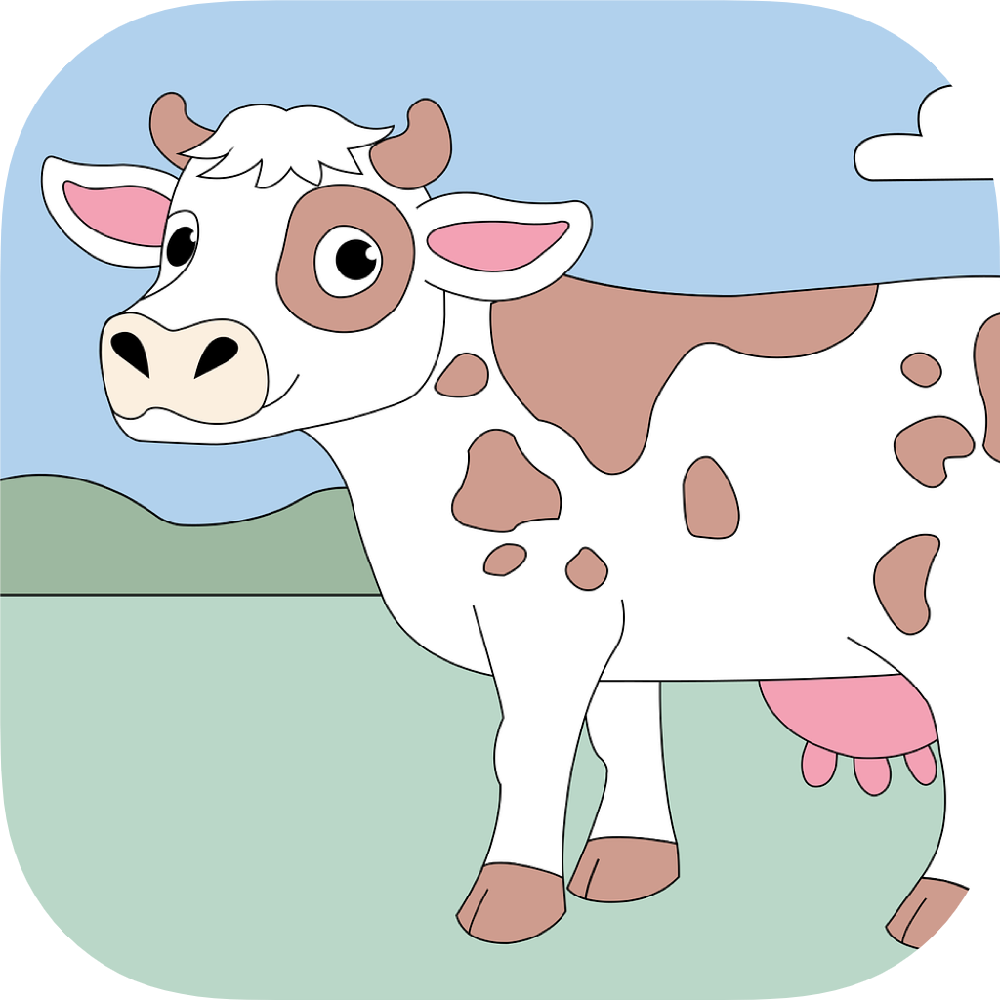

## 👋 hello, i'm matteo
i'm an ios developer with a design obsession. i build apps that don't just work—they feel right.
when i'm not deep in swift code, you'll find me tweaking animations, reverse engineering things for fun, or—plot twist—actually touching grass (i know, shocking concept in the dev world, but sometimes it's necessary and i promise i'm not glued to my mac 24/7).

my approach is pretty straightforward: design in swiftui, build the app foundation, boom — the app is done! *(well, not really... i forgot about fighting with xcode.)*

🏅 **recognized by apple as a swift student challenge winner in 2024**

### 🛠 what i do
i focus on apple ecosystem development, primarily using swift and swiftui. i handle both the technical implementation and visual design—because i believe an app is only as good as its weakest aspect.
currently working on personal projects.

### 🧰 my toolkit
- **ios/macos development** - swift, swiftui, uikit/appkit when needed
- **interface design** - because good code deserves good design
- **system-level work** - messing around with apple's frameworks and internals for private projects
- **optimization** - making sure every interaction feels smooth

### 🚀 current projects
-  got one app that's practically ready to ship: **[ticks](https://ticksapp.com)**. as any indie dev knows, shipping an app means wearing all the hats—so i'm currently deep in after effects for promo videos, perfecting app store screenshots, and crafting all the marketing materials.
- working on some cool stuff that i'm not ready to talk about yet. let's just say it involves productivity and some experiments with apple's latest wwdc25 apis.

### 📜 old projects
my earlier work focused on jailbreak tools and exploits—diving deep into ios internals and system-level modifications.
-  **[DynamicCow](https://github.com/matteozappia/DynamicCow)** – enables dynamic island on any device running ios 16.0-16.1.2 using macdirtycow exploit
-  **[DynamicCowTS](https://github.com/matteozappia/DynamicCowTS)** – extends dynamic island support to ios 16.0-16.6.1 and 17.0 via trollstore
-  **[Sonic](https://havoc.app/package/sonic)** – ringtone creation tool with audio cutting, online sources, and system integration
-  **[Edictus](https://github.com/matteozappia/Edictus)** – dynamic and live wallpaper creator with photo library integration and random image mixing

### 🤝 collaborations
always interested in exciting projects, especially involving:
- innovative ios applications
- developer tools and utilities
- interfaces that make complex things simple

### 📫 let's connect
if you're building something interesting or just want to chat about development, design, or the latest wwdc announcements, feel free to reach out.
find me at:
- here ._.
- [twitter/x](https://x.com/aboutzeph)
---
*building things that matter, one commit at a time... hopefully*
